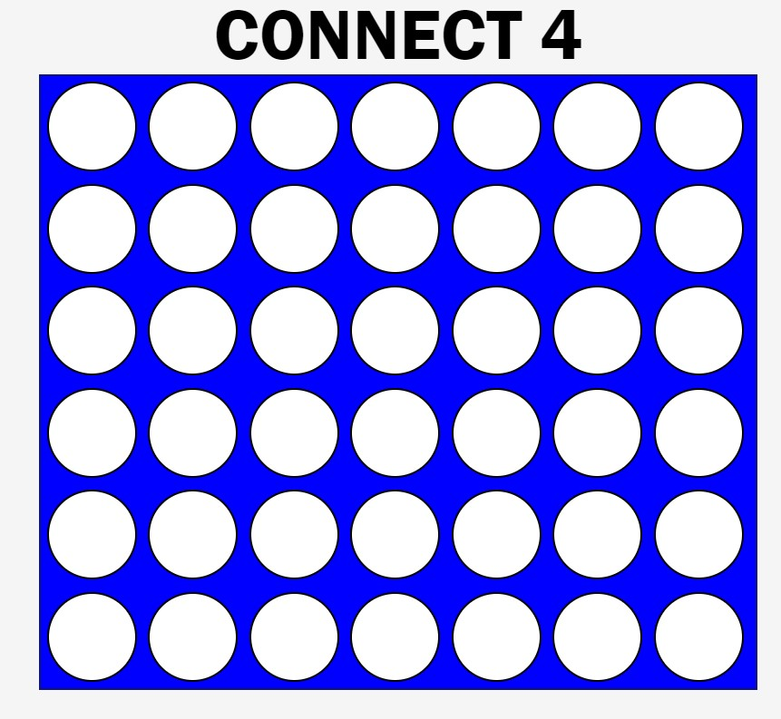

# Connect 4 Game 
[Live Game](https://romyjeanpierre.github.io/CONNECT-4-Project/)

## About The Project
Connect four is a two-player game in which there will be a player 1/ red and a player 2/yellow. Player red will start the game. The game board is a 6x7 grid. Two players take turns to drop a checker into any of the grid's columns. The chip can fall only to the lowest empty location within the selected column. The objective of the game is to be the first to build a row of four checkers horizontally, vertically, or diagonally.

[![Play Connect 4][]](http://127.0.0.1:5500/labs-hw/Connect-4/index.html)

### Built With
* [HTML] [index.html](https://github.com/romyjeanpierre/labs-HW/blob/main/Connect-4/index.html)
* [CSS] [style.css](https://github.com/romyjeanpierre/labs-HW/blob/main/Connect-4/style.css)
* [JavaScript] [script.js](https://github.com/romyjeanpierre/labs-HW/blob/main/Connect-4/script.js)
* [Visual Studio Code] [VS Code](https://code.visualstudio.com/)

### Prerequisites

* JavaScript, HTML and CSS
* knowledge of DOM, flexbox, loops, functions, arrays, classes and events. 

## Implementation

### HTML
1) 
    Set up the HTML file 
    - Add script.js file 
    - Link the the style.css 
    - Create a heading tag  - CONNECT 4  
    - Create a div id for the board and a div class for each cell in every row and column on the board - totaling 42 

### CSS
2)  
    Style your game and create the board with CSS
    - Center the items in the body of the page, choose the font style, size and background color 
    - The game board is displayed using flex. Each cell is a div element with a border and border-radius to make it look like a checker. The color of the checker is determined by the CSS classes red and yellow.
    
### JavaScript
3)  
    The game board is represented as a two-dimensional array in  JavaScript. Each cell in the array corresponds to a cell on the game board. The value of each cell in the array is either 0 (empty), 1 (player 1's checker), or 2 (player 2's checker).

    The game logic is implemented in JavaScript. The cellClick function handles the click event for each cell. It determines the lowest empty location in the clicked column and drops the current player's checker there. It then checks if the current player has won the game and updates the game state accordingly.

    The checkWin function checks if the current player has won the game. It checks all possible directions (horizontal, vertical, and diagonal) for a line of four checkers of the same color.

    The restartGame function resets the game state and starts a new game.

## Usage

To play the game, open the HTML file in a web browser. The game starts with player 1's turn. Click on a column to drop a checker. The game ends when one player forms a line of four checkers or when all cells are filled. Click the "Restart Game" button to start a new game.

## Additional features to be added
    - Allow players the option to decide who plays first
    - allow the player the option to play against the   computer 

### Contact

Your Name - [Romy Jean-Pierre](romyjeanpierre@yahoo.com) - romyjeanpierre@yahoo.com

Project Link: [Github](https://github.com/romyjeanpierre/labs-HW/tree/main/Connect-4)

## Acknowledgments

* [README Template](https://github.com/othneildrew/Best-README-Template/blob/master/BLANK_README.md?plain=1)
* [A Complete Guide to Flexbox](https://css-tricks.com/snippets/css/a-guide-to-flexbox/)
* [CSS Shapes Explained: How to Draw a Circle, Triangle, and More Using Pure CSS](https://www.freecodecamp.org/news/css-shapes-explained-how-to-draw-a-circle-triangle-and-more-using-pure-css/#:~:text=To%20create%20a%20circle%20we,will%20get%20an%20oval%20instead)
* [Rules of Connect 4](https://www.fgbradleys.com/rules/Connect%20Four.pdf)
* [How to Build Connect 4 with Javascript HTML CSS](https://www.youtube.com/watch?v=4ARsthVnCTg&t=829s)
* [How to make a Connect-4 Game with html, css & javascript](https://www.youtube.com/watch?v=TGJlcQWPHJc&t=615s)
* [0 auto in CSS](https://www.tutorialspoint.com/how-does-auto-property-work-in-margin-0-auto-in-css#:~:text=The%20%22margin%3A%200%20auto%22,enables%20this%20centering%20to%20occur.)
* [Map](https://developer.mozilla.org/en-US/docs/Web/JavaScript/Reference/Global_Objects/Map)
* [JavaScript Array map()](https://www.w3schools.com/jsref/jsref_map.asp)
* [Array.prototype.fill()](https://developer.mozilla.org/en-US/docs/Web/JavaScript/Reference/Global_Objects/Array/fill)
* [HTMLElement: dataset property](https://developer.mozilla.org/en-US/docs/Web/API/HTMLElement/dataset)
* [Dataset (dataset) Property - Javascript DOM](https://www.youtube.com/watch?v=Pt8RyyUWCtM)
* [Style display Property](https://www.w3schools.com/jsref/prop_style_display.asp#:~:text=A%20block%20element%20fills%20the,similar%20to%20the%20visibility%20property.)
* [How the Question Mark (?) Operator Works in JavaScript](https://www.freecodecamp.org/news/how-the-question-mark-works-in-javascript/#:~:text=items%20or%20parts.-,The%20%3F,when%20the%20condition%20is%20true.)

